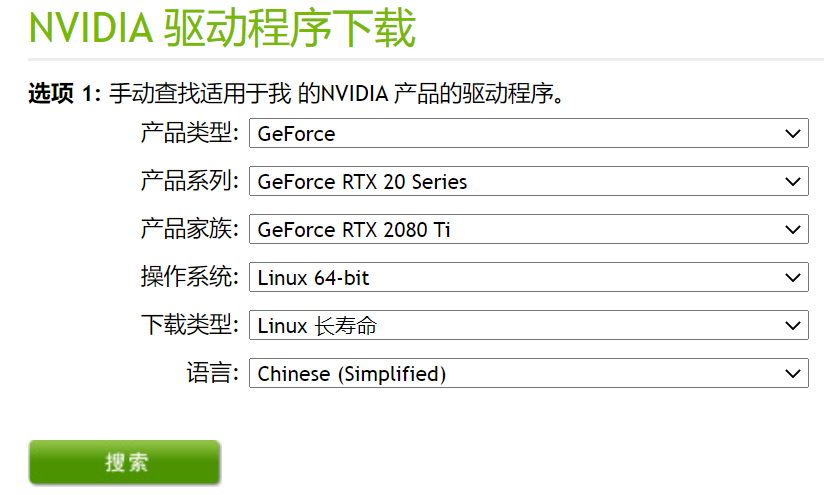
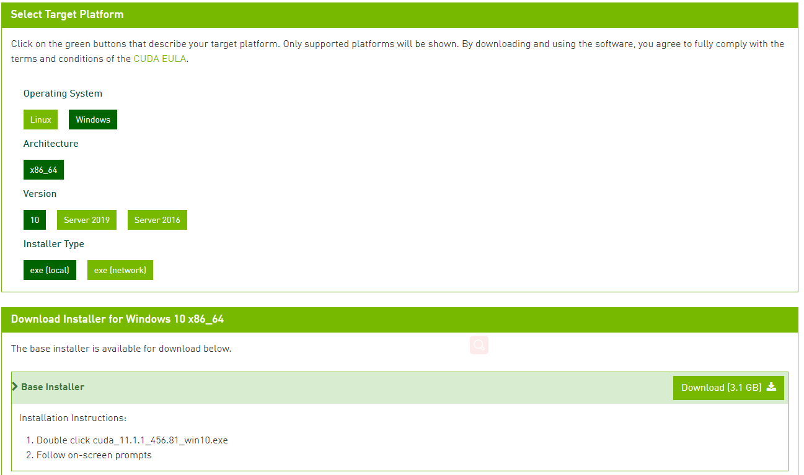
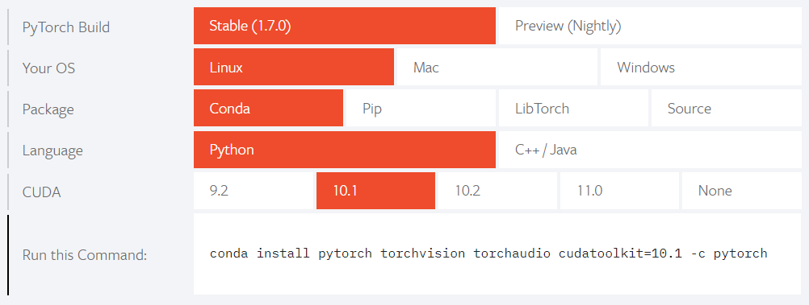

## 深度学习装机指南

[推荐Linux (UBUNTU)系统] ([参考UBUNTU18.04安装教程](https://blog.csdn.net/baidu_36602427/article/details/86548203))

- 安装NVIDIA显卡驱动
[download NVIDIA driver](https://www.nvidia.cn/Download/index.aspx?lang=cn)



[UBUNTU系统下NVIDIA driver安装教程](https://jinghongkyq.github.io/install_nvidia_driver.html)

- 安装CUDA: 加速程序
[download cuda](https://developer.nvidia.com/cuda-downloads?target_os=Windows&target_arch=x86_64&target_version=10&target_type=exelocal)


[UBUNTU系统下CUDA/CUDNN安装教程](https://jinghongkyq.github.io/install_cuda_cudnn.html)

- 安装pycharm: IDE
[download pycharm](https://www.jetbrains.com/pycharm/download/#section=windows) (下载Community版本)

- 安装anaconda: 环境版本管理平台  ([参考安装教程](https://www.jianshu.com/p/62f155eb6ac5))
  [download anaconda](https://www.anaconda.com/products/individual)
   - jupyter: IDE
   - spyder: IDE
   
- anaconda简单用法
```
# 创建一个环境
conda create -n mypython_env python=3.7

# 激活环境
conda activate mypython_env

# 退出环境
conda deactivate
```

- 安装pytorch

[pytorch官网](https://pytorch.org/)
```
conda install pytorch torchvision torchaudio cudatoolkit=10.1 -c pytorch
```



- 安装TensorFlow
[TensorFlow官网](https://tensorflow.google.cn/)
```
# Requires the latest pip  
pip install --upgrade pip  
  
# Current stable release for CPU and GPU  
pip install tensorflow
  
# Or try the preview build (unstable)  
pip install tf-nightly
```

- [python菜鸟教程](https://www.runoob.com/python/python-tutorial.html)

- [pytorch中文教程](http://www.pytorch123.com/)

- [pytorch英文教程](https://pytorch.org/tutorials/)

- [TensorFlow官方教程](https://tensorflow.google.cn/learn)

- 推荐安装Terminal IDE 
[download terminus](https://www.termius.com/)
